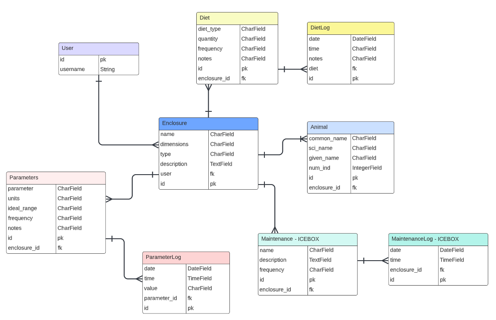

# Zooalog

## Description: 

Zooalog is an animal husbandry tracking app that allows hobbyists with aquariums or terrestrial enclosures to keep track of their animal care practices.

Users can keep track of animals in their enclosures, and create logs of diet and important habitat parameters.

Why Zooalog?

I worked as a biologist for ten years before transitioning to a software engineering career. The majority of my time as a biologist was spent working closely with animal care departments at aquariums; collecting data, collecting and caring for specimens, and creating biologically appropriate enclosures. I have also spent time working with veterinary care facilities, and with animal care departments that specialize in non-marine organisms.

During my career I quickly realized that to maximize the efficiency of animal care and to ensure best husbandry practices, keeping thorough and concise logs was critical. There are certain well-known animal husbandry tracking apps on the market, but the ones that hold the market are either too expensive for smaller organizations, and the usability is sub-standard. In creating Zooalog, I hoped to build a product that combined years of animal care experience with a modern and approachable user experience that was financially feasible for small-scale operations.

Zooalog is still small. It is currently more equipped for the hobbyist than an animal care department, but this journey is just beginning!

For now, hobbiests can use this application to log inputs and outputs of animals in their care. Logs can include diet and customizable abiotic factors (parameters) including but not limited to temperature, humidity, salinity, pH, O2 levels and NO3. 

This app is enclosure-centric, meaning the user must create an Enclosure in order to log an animal. As such, this app is better designed for users with critters such as fish, reptiles, and contained mammals or birds. In theory a user could log their dog or cat, but they would have to do so by first creating an Enclosure. Perhaps in that case they could just call the Enclosure "House", but really this app is more catered towards the former examples. 

## Technologies Used

 

 
 

## Getting Started!

App is under construction so link is not yet available! Stay tuned.

## Screenshots

    
 Enclosure Index 

    

    
 Enclosure Detail 

    

    
 Expanded Enclosure Detail 

    

    
 Parameter Information 

    

    
 Parameter Log Example 

    

## Goals

* User-friendly interface
* User authentication
* Page authorization
* Responsive interface

## Planning Links

[Wireframe: Whimsical](https://whimsical.com/zooalog-D5avFK95o1bgy94H4kbUSd@3CRerdhrAw89dQ8hhdkVHFp1)

[User Stories: Trello](https://trello.com/invite/b/MhlMC0Qn/c32c891202deb797028f567e7c5d68d3/zooalog)

    
 ERD created with Lucidchart 

    

## Icebox

* Connect app to weather API
* Create a maintenance model
* Graph options for viewing data
* Allow multiple users to connect to a joint account

## Progress Report

* Dec 21, 2022: Change some CSS and HTML elements throughout doc to improve UI/UX. Add about page.
* Dec 20, 2022: Home page HTML and CSS
* Dec 19, 2022: Tidy up existing functions in views.Create diet model and diet log model and their pathways
* Dec 17, 2022: User can now create a log entry for a parameter.
* Dec 16, 2022: Set up the Log templates and pathways. Add ParameterLog model. Create ParameterLogForm and associated URL paths and views so that it renders in the log_forms template. 
* Dec 14, 2022: Add Parameters model. Complete CRUD for Animal and Parameters models. Create templates/parameters/info.html tables with information about commonly used parameters. 
* Dec 13, 2022: Change Test model to Enclosure and change Sub model to Animal. Delete db and re-migrate. Move create animal form (previously create sub form) to its own page. 
* Dec 11 2022: Set up user authentication and authorization. Signup, login, and logout functionality are all up and running.
* Dec 8 2022: Implement full CRUD for Test. Form to create new Tests and ability to update and delete. Add Sub Model to models.py, migrate and can view. Form to create new Sub.
* Dec 7 2022: Create Test model and migrate to postgreSQL. Set up templates (base.html, about.html, test/detail.html, test/index.html), set up some basic CSS, and config routes (urls.py and views.py) for each
* Dec 6 2022: Initial commit. Deploy to Heroku and create blank home page with URL/Views route config